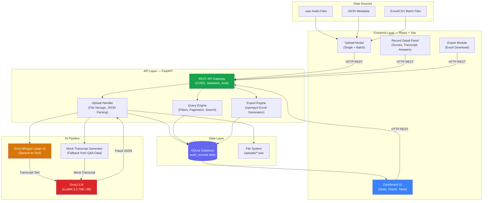
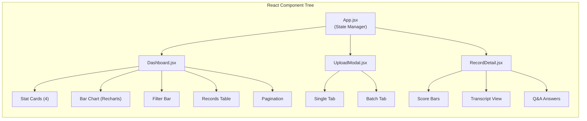
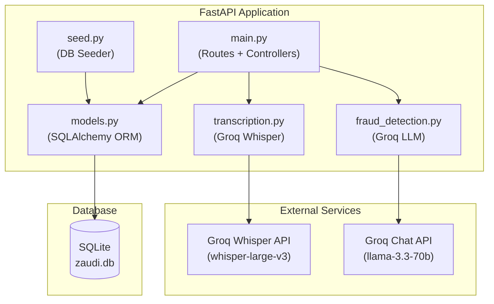
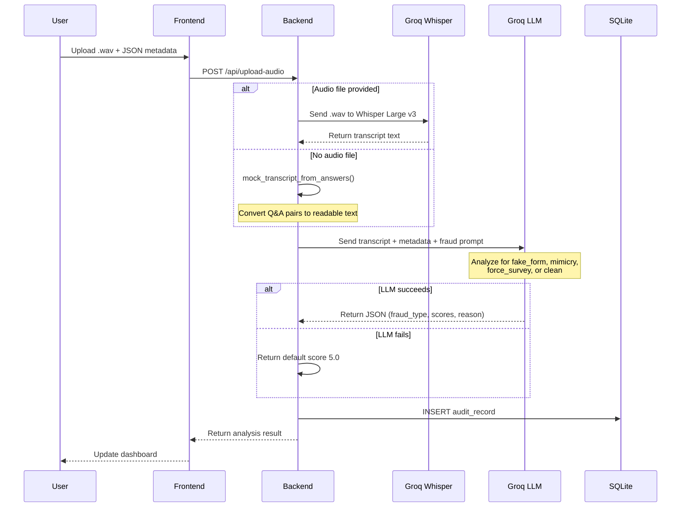
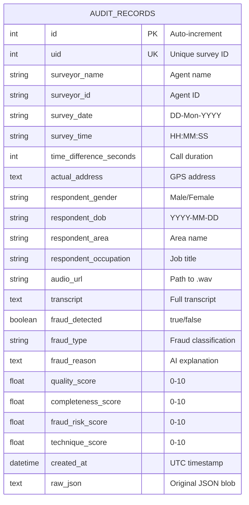
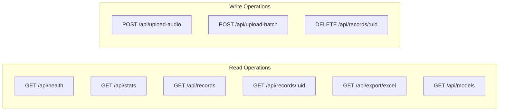

# Z-AUDIT — System Architecture (Detailed)

> **Version:** 1.0 MVP | **Date:** March 2026  
> **Company:** Zeex AI Private Limited | IIT Madras Research Park, Chennai

---

## 1. High-Level System Overview

Z-AUDIT is an AI-powered audio quality auditing platform that automates the detection of fraud and quality assessment in field survey calls across India. The system ingests recorded audio files and structured metadata, processes them through an AI pipeline, and presents results on a real-time dashboard.



---

## 2. Component Architecture

### 2.1 Frontend Architecture (React + Vite + Tailwind CSS)

The frontend is a single-page application (SPA) built with React 18, bundled by Vite, and styled with Tailwind CSS.



**Key Design Decisions:**
- **State Management:** React `useState` + `useEffect` + `useCallback` (no Redux — MVP simplicity)
- **API Communication:** Native `fetch()` via `api.js` helper module
- **Charts:** Recharts library for the fraud breakdown bar chart
- **Styling:** Tailwind CSS utility classes + custom CSS for glassmorphism, gradients, and animations
- **Proxy:** Vite dev server proxies `/api/*` requests to `localhost:8000` (no CORS issues in dev)

**Component Responsibilities:**

| Component | Responsibility |
|-----------|---------------|
| `App.jsx` | Global state (stats, records, filters, modals), API calls, layout shell |
| `Dashboard.jsx` | 4 stat cards, Recharts bar chart, filter bar (dropdown/slider/search), records table with pagination |
| `UploadModal.jsx` | Two tabs (single audio + batch Excel), drag-and-drop, model selector, progress bar |
| `RecordDetail.jsx` | Slide-out panel with fraud badge, 4 score progress bars, survey metadata grid, transcript viewer, Q&A list |
| `api.js` | Centralized API helper — all backend endpoint calls in one place |

---

### 2.2 Backend Architecture (Python FastAPI)

The backend is a monolithic FastAPI application with a clean module separation.



**Module Responsibilities:**

| Module | Lines | Responsibility |
|--------|-------|---------------|
| `main.py` | ~310 | FastAPI app, 9 REST endpoints, CORS, file handling, request validation |
| `models.py` | ~80 | SQLAlchemy `AuditRecord` model, SQLite engine, session management, `to_dict()` serializer |
| `transcription.py` | ~70 | Groq Whisper API call, `mock_transcript_from_answers()` fallback |
| `fraud_detection.py` | ~140 | Fraud prompt template, Groq LLM call, 6 model options, JSON parsing, fallback |
| `seed.py` | ~180 | 9 pre-labeled fraud records with mock transcripts for demo |

---

### 2.3 AI Pipeline — Detailed Flow



**Fraud Analysis Prompt Structure:**

The LLM receives a carefully structured prompt containing:

1. **Fraud type definitions** — detailed descriptions of each fraud pattern
2. **Survey metadata** — UID, surveyor, date/time, duration, GPS movement, respondent details
3. **Recorded answers** — Q&A pairs extracted from the JSON metadata
4. **Transcript** — either real (from Whisper) or mock (from Q&A pairs)
5. **Output format** — strict JSON schema with 4 scores and fraud classification
6. **Scoring heuristics** — duration-based suspicion thresholds (<300s = suspicious)

**Key Fraud Detection Signals:**

| Signal | Indicates |
|--------|-----------|
| Duration < 300 seconds | Very suspicious |
| Duration 300–600 seconds | Borderline |
| Only one voice pattern | Mimicry |
| Background noise only | Fake form |
| Gender mismatch (registered vs. voice) | Force survey |
| Surveyor dominates answers | Force survey |
| No genuine Q&A exchange | Fake form |

---

### 2.4 Database Schema



**Score Definitions:**

| Score | Range | Meaning |
|-------|-------|---------|
| `quality_score` | 0–10 | Overall call quality (10 = perfect, 0 = useless) |
| `completeness_score` | 0–10 | Survey coverage (questions asked, answers captured) |
| `fraud_risk_score` | 0–10 | Fraud likelihood (10 = definitely fraud) |
| `technique_score` | 0–10 | Surveyor questioning technique quality |

---

## 3. Data Flow Architecture

### 3.1 Single Upload Flow

```
User drops .wav + pastes JSON
    ↓
Frontend sends FormData to POST /api/upload-audio
    ↓
Backend saves .wav to /uploads/{uid}.wav
    ↓
Backend sends audio to Groq Whisper → gets transcript
    ↓ (or fallback)
Backend generates mock transcript from audioanswers
    ↓
Backend sends transcript + metadata to Groq LLM
    ↓
LLM returns: { fraud_detected, fraud_type, scores, reason }
    ↓
Backend creates AuditRecord in SQLite
    ↓
Backend returns analysis result to frontend
    ↓
Dashboard auto-refreshes with new record
```

### 3.2 Batch Upload Flow

```
User drops Excel/CSV file
    ↓
Frontend sends file to POST /api/upload-batch
    ↓
Backend reads Excel/CSV with pandas
    ↓
For each row:
    ├── Parse JSON from row data
    ├── Generate mock transcript from audioanswers
    ├── Send to Groq LLM for analysis
    ├── Create AuditRecord in database
    └── Track success/errors
    ↓
Backend returns: { processed: [...], errors: [...] }
    ↓
Dashboard refreshes with all new records
```

### 3.3 Input Data Format (data_with_json.csv)

Each row in the CSV contains a JSON blob with this structure:

```json
{
  "surveyor": "113145 - (Vansh Patil)",
  "date": "12-Mar-2026",
  "time": "12:22:43",
  "id1": 111379,
  "startlat": 16.8589304,
  "endlat": 16.8589307,
  "startlong": 74.0040899,
  "endlong": 74.0041283,
  "movement": "1",
  "timedifference": "907 seconds",
  "audiourls": [
    ["26-SACHIN LAVATE", "/media/audio/111379.wav", "FR NAME"],
    ["Registration", "/media/registration/111379_registration.wav", "USER"]
  ],
  "audioanswers": [
    ["MALE/ पुरुष", "GENDER"],
    ["नाही / NO / नहीं", "Health problem question..."],
    ...
  ],
  "actualaddress": "V253+MHM, Shittur..., Maharashtra 416213, India",
  "tldetails": "26-SACHIN LAVATE",
  "registration_details": [
    ["7756095862", "MOBILE NUMBER"],
    ["2007-08-07", "DOB"],
    ["Male", "GENDER"],
    ["shittur", "AREA"],
    ["Student", "OCCUPATION"]
  ]
}
```

**Key fields extracted:**
- `id1` → UID (unique survey identifier)
- `surveyor` → Surveyor name + ID
- `timedifference` → Call duration (parsed to seconds)
- `movement` → GPS movement in meters during survey
- `audioanswers` → Array of [answer, question] pairs (trilingual: Marathi/Hindi/English)
- `registration_details` → Respondent profile (phone, DOB, gender, area, occupation)
- `actualaddress` → GPS-resolved address

---

## 4. API Architecture

### 4.1 Endpoint Map



### 4.2 Request/Response Contracts

**POST /api/upload-audio**
```
Request: multipart/form-data
  - metadata: string (JSON)
  - model: string (LLM model ID)
  - audio_file: file (optional .wav)

Response: {
  message: string,
  record: AuditRecord,
  analysis: { fraud_detected, fraud_type, scores... }
}
```

**GET /api/records**
```
Query: ?page=1&limit=20&fraud_type=fake_form&min_score=0&search=111379

Response: {
  records: AuditRecord[],
  total: int,
  page: int,
  limit: int,
  total_pages: int
}
```

---

## 5. Security Considerations

| Aspect | Implementation |
|--------|---------------|
| API Keys | Stored in `.env`, never committed to git |
| CORS | Restricted to frontend origins (localhost:5173, localhost:3000) |
| Input Validation | FastAPI Pydantic models enforce types |
| File Upload | Limited to audio formats, stored server-side |
| SQL Injection | SQLAlchemy ORM (parameterized queries) |
| Data Privacy | Audio files stored locally, not sent to third parties (except Groq for transcription) |

---

## 6. Scalability Considerations (Beyond MVP)

| Current (MVP) | Production Path |
|---------------|-----------------|
| SQLite | → PostgreSQL (multi-concurrent writes) |
| Single server | → Kubernetes pods (auto-scaling) |
| Synchronous processing | → Celery + Redis task queue |
| Local file storage | → AWS S3 / GCS bucket |
| Groq free tier | → Dedicated Groq plan or self-hosted Whisper |
| No auth | → JWT + RBAC (admin, QA manager, viewer) |
| 9 test records | → Millions of audit records |

---

## 7. Technology Stack Summary

| Layer | Technology | Version | Purpose |
|-------|-----------|---------|---------|
| **Frontend** | React | 18.3 | UI library |
| **Frontend** | Vite | 6.0 | Build tool + dev server |
| **Frontend** | Tailwind CSS | 3.4 | Utility-first CSS framework |
| **Frontend** | Recharts | 2.12 | Chart library |
| **Backend** | Python | 3.11 | Runtime |
| **Backend** | FastAPI | 0.115 | Web framework |
| **Backend** | SQLAlchemy | 2.0 | ORM |
| **Backend** | Groq SDK | 0.12 | AI API client |
| **Database** | SQLite | — | Embedded database |
| **AI (ASR)** | Whisper Large v3 | — | Speech-to-text (via Groq) |
| **AI (NLP)** | LLaMA 3.3 70B | — | Fraud analysis (via Groq) |
| **Export** | openpyxl | 3.1 | Excel generation |
| **Deploy** | Docker | — | Containerization |

---

*Z-AUDIT Architecture Document v1.0 | Zeex AI Private Limited | March 2026*
